# 📊 Pipeline ETL de Datos de Ventas en Microsoft Fabric

> **Proyecto completo de ingeniería de datos** que demuestra el dominio de Microsoft Fabric para la construcción de pipelines ETL empresariales, procesamiento de datos con PySpark y creación de flujos de datos automatizados.

[](https://fabric.microsoft.com/)
[](https://spark.apache.org/)
[](https://www.python.org/)

---

## 📑 Tabla de Contenidos

1. [Descripción del Proyecto](#-descripción-del-proyecto)
2. [Arquitectura del Proyecto](#-arquitectura-del-proyecto)
3. [Proceso Paso a Paso](#-proceso-paso-a-paso)
   - [Paso 1: Configuración del Copy Activity](#paso-1-configuración-del-copy-activity)
   - [Paso 2: Ejecución del Pipeline de Ingesta](#paso-2-ejecución-del-pipeline-de-ingesta)
   - [Paso 3: Carga de Datos en el Notebook](#paso-3-carga-de-datos-en-el-notebook)
   - [Paso 4: Transformación y Limpieza de Datos](#paso-4-transformación-y-limpieza-de-datos)
   - [Paso 5: Pipeline Completo con Validaciones](#paso-5-pipeline-completo-con-validaciones)
   - [Paso 6: Análisis de Calidad de Datos](#paso-6-análisis-de-calidad-de-datos)
   - [Paso 7: Transformaciones Avanzadas](#paso-7-transformaciones-avanzadas)
   - [Paso 8: Agregaciones y Métricas de Negocio](#paso-8-agregaciones-y-métricas-de-negocio)
   - [Paso 9: Creación de Tablas Dimensionales](#paso-9-creación-de-tablas-dimensionales)
   - [Paso 10: Reporte de Calidad de Datos](#paso-10-reporte-de-calidad-de-datos)
   - [Paso 11: Creación de Capa Gold - Agregaciones](#paso-11-creación-de-capa-gold---agregaciones)
   - [Paso 12: Top Productos y Análisis](#paso-12-top-productos-y-análisis)
   - [Paso 13: Análisis de Descuentos](#paso-13-análisis-de-descuentos)
   - [Paso 14: Customer Insights](#paso-14-customer-insights)
   - [Paso 15: Executive Summary](#paso-15-executive-summary)
   - [Paso 16: Conexión de Origen de Datos](#paso-16-conexión-de-origen-de-datos)
   - [Paso 17: Pipeline Master con Programación](#paso-17-pipeline-master-con-programación)
   - [Paso 18: Deployment Pipeline - CI/CD](#paso-18-deployment-pipeline---cicd)
4. [Habilidades Demostradas](#-habilidades-demostradas)
5. [Tecnologías Utilizadas](#-tecnologías-utilizadas)
6. [Contacto](#-contacto)

---

## 🎯 Descripción del Proyecto

Este proyecto implementa una **solución ETL completa en Microsoft Fabric** para el procesamiento y análisis de datos de ventas de Amazon. El pipeline extrae datos desde fuentes externas, los transforma aplicando lógica de negocio compleja utilizando PySpark, y los carga en un lakehouse optimizado para análisis empresarial.

### 🌟 Características Principales

- **Pipeline ETL Automatizado**: Orquestación completa del flujo de datos desde la extracción hasta la carga
- **Procesamiento Distribuido**: Transformaciones de datos usando PySpark en notebooks de Fabric
- **Lakehouse Medallion Architecture**: Implementación de capas Bronze, Silver y Gold para organización de datos
- **Data Flow Integration**: Integración de flujos de datos con múltiples conectores y transformaciones
- **Deployment Pipelines**: Canalizaciones de implementación para facilitar el movimiento de soluciones entre entornos (Development → Test → Production)
- **Programación Automatizada**: Ejecución programada de pipelines para actualización continua de datos

---

## 🏗️ Arquitectura del Proyecto

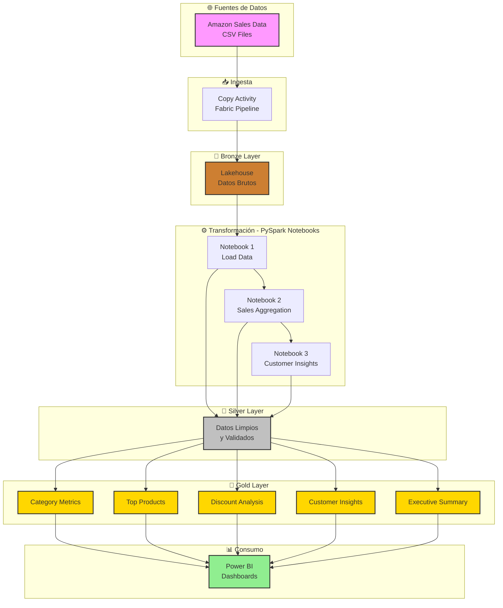
```mermaid
flowchart TB
    subgraph Fuentes["🌐 Fuentes de Datos"]
        A[Amazon Sales Data<br/>CSV Files]
    end
    
    subgraph Ingesta["📥 Ingesta"]
        B[Copy Activity<br/>Fabric Pipeline]
    end
    
    subgraph Bronze["🥉 Bronze Layer"]
        C[Lakehouse<br/>Datos Brutos]
    end
    
    subgraph Transformacion["⚙️ Transformación - PySpark Notebooks"]
        D1[Notebook 1<br/>Load Data]
        D2[Notebook 2<br/>Sales Aggregation]
        D3[Notebook 3<br/>Customer Insights]
    end
    
    subgraph Silver["🥈 Silver Layer"]
        E[Datos Limpios<br/>y Validados]
    end
    
    subgraph Gold["🥇 Gold Layer"]
        F1[Category Metrics]
        F2[Top Products]
        F3[Discount Analysis]
        F4[Customer Insights]
        F5[Executive Summary]
    end
    
    subgraph Consumo["📊 Consumo"]
        G[Power BI<br/>Dashboards]
    end
    
    A --> B
    B --> C
    C --> D1
    D1 --> D2
    D2 --> D3
    D1 --> E
    D2 --> E
    D3 --> E
    E --> F1
    E --> F2
    E --> F3
    E --> F4
    E --> F5
    F1 --> G
    F2 --> G
    F3 --> G
    F4 --> G
    F5 --> G
    
    style A fill:#f9f,stroke:#333,stroke-width:2px
    style C fill:#cd7f32,stroke:#333,stroke-width:2px
    style E fill:#c0c0c0,stroke:#333,stroke-width:2px
    style F1 fill:#ffd700,stroke:#333,stroke-width:2px
    style F2 fill:#ffd700,stroke:#333,stroke-width:2px
    style F3 fill:#ffd700,stroke:#333,stroke-width:2px
    style F4 fill:#ffd700,stroke:#333,stroke-width:2px
    style F5 fill:#ffd700,stroke:#333,stroke-width:2px
    style G fill:#90EE90,stroke:#333,stroke-width:2px
```

---

## 🔧 Proceso Paso a Paso

A continuación se documenta todo el proceso de construcción del pipeline ETL, desde la configuración inicial hasta la implementación en producción.

---

### Paso 1: Configuración del Copy Activity

El primer paso consiste en configurar la actividad de copia de datos (Copy Activity) que extrae los datos desde la fuente externa hacia nuestro Lakehouse.

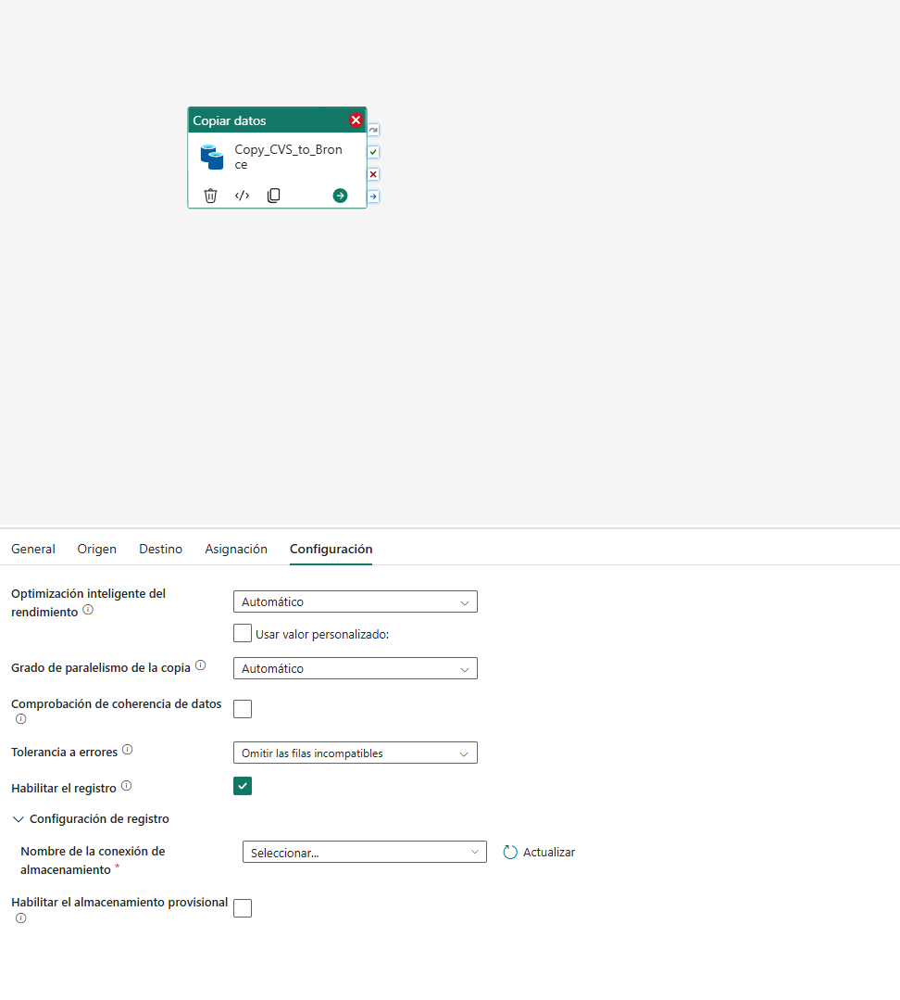

**¿Qué estamos haciendo aquí?**

En esta captura se muestra la configuración de la actividad **"Copy_CVS_to_Bronze"** dentro del pipeline de datos. Esta actividad es fundamental ya que es el punto de entrada de todos los datos al sistema.

**Configuraciones aplicadas:**

| Configuración | Valor | Descripción |
|---------------|-------|-------------|
| Optimización inteligente del rendimiento | Automático | Fabric optimiza automáticamente el rendimiento de la copia |
| Grado de paralelismo de la copia | Automático | Se ajusta dinámicamente según la carga |
| Comprobación de coherencia de datos | Desactivada | Para mejor rendimiento en carga inicial |
| Tolerancia a errores | Omitir las filas incompatibles | Continúa la carga aunque haya errores menores |
| Habilitar el registro | ✅ Activado | Registra toda la actividad para auditoría |

**¿Por qué es importante esta configuración?**

- La **tolerancia a errores** configurada para omitir filas incompatibles nos permite cargar datos aunque algunos registros tengan problemas de formato
- El **registro habilitado** nos proporciona trazabilidad completa de la operación
- La **optimización automática** garantiza el mejor rendimiento sin necesidad de ajustes manuales

---

### Paso 2: Ejecución del Pipeline de Ingesta

Una vez configurado, ejecutamos el pipeline para verificar que la ingesta funciona correctamente.

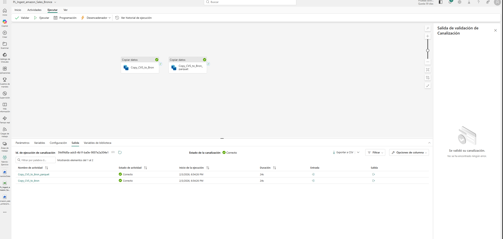

**¿Qué observamos en esta captura?**

Esta imagen muestra el resultado de la ejecución del pipeline de ingesta con **estado exitoso**. Podemos ver:

- **Nombre del pipeline**: `PL_Ingest_amazon_Sales_Bronze`
- **Actividades ejecutadas**: 
  - `Copy_CVS_to_Bron` (Copiar CSV a Bronze)
  - `Copy_CVS_to_Bron_particion` (Copiar CSV con particionamiento)
- **Estado de la canalización**: ✅ Correcto
- **Duración**: Tiempo de ejecución registrado para cada actividad

**Validación de la salida:**

El panel derecho muestra "Salida de validación de Canalización" confirmando que:
- Se validó la canalización correctamente
- No se encontraron errores críticos
- Los datos fueron transferidos al destino

---

### Paso 3: Carga de Datos en el Notebook

Con los datos ya en el Lakehouse (capa Bronze), procedemos a cargarlos en un notebook PySpark para su procesamiento.

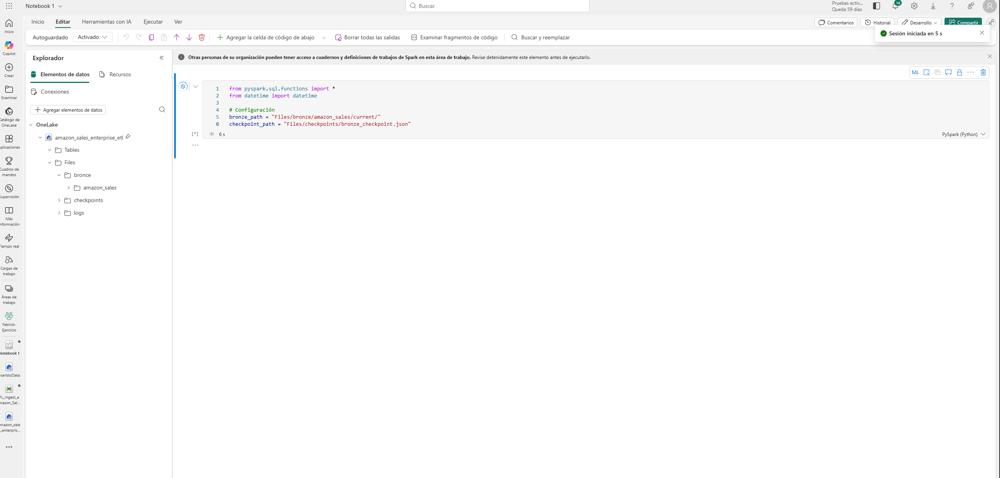

**¿Qué estamos haciendo aquí?**

En este notebook estamos configurando la conexión al Lakehouse y definiendo las rutas de los archivos de datos. El código visible muestra:

```python
from pyspark.sql.functions import *
from pyspark.sql import SparkSession

# Definición de rutas al Lakehouse
amazon_path = "Files/amazon/amazon_sales/amazon_data4471.csv"
storage_path = "Files/amazon/production_amazon_data4471.csv"
```

**Componentes del Explorador (panel izquierdo):**

Se puede observar la estructura del Lakehouse:
- 📁 **amazon_sales_enterprise_pl**: Lakehouse principal
- 📁 **Files**: Carpeta de archivos
  - 📁 **amazon_sales**: Datos de ventas
  - 📁 **WebDatasets**: Datasets externos
- 📁 **Tables**: Tablas Delta Lake creadas

Esta estructura sigue las mejores prácticas de organización de datos en Fabric.

---

### Paso 4: Transformación y Limpieza de Datos

Continuamos con la transformación y limpieza de los datos cargados.

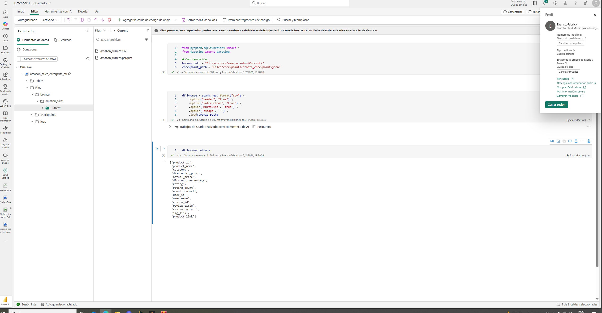

**¿Qué estamos haciendo aquí?**

Esta captura muestra código PySpark avanzado para la transformación de datos:

```python
# Configuración de la sesión Spark
df_bronze = spark.read.format("csv") \
    .option("header", "true") \
    .option("inferSchema", "true") \
    .load(amazon_path)

# Visualización del esquema de datos
df_bronze.printSchema()
```

**Salida del esquema (panel inferior):**

El notebook muestra la estructura de los datos con todos los campos detectados:
- `product_id`: Identificador del producto
- `product_name`: Nombre del producto
- `category`: Categoría del producto
- `discounted_price`: Precio con descuento
- `actual_price`: Precio original
- `discount_percentage`: Porcentaje de descuento
- `rating`: Calificación del producto
- `rating_count`: Número de calificaciones
- Y más campos relacionados con ventas...

**Panel de Copilot (derecha):**

Se observa la integración con **Microsoft Copilot** que proporciona sugerencias inteligentes para el código PySpark.

---

### Paso 5: Pipeline Completo con Validaciones

Construimos el pipeline completo que incluye actividades de validación y bifurcación condicional.

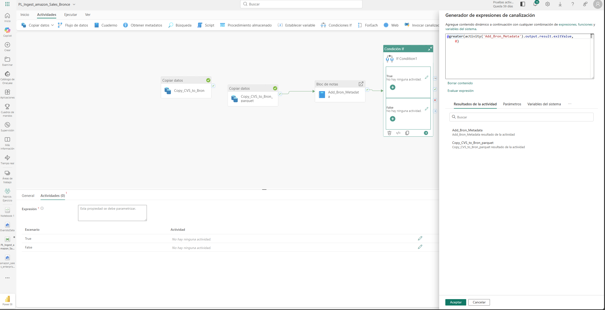

**¿Qué estamos haciendo aquí?**

Esta captura muestra un **pipeline orquestado** con múltiples componentes:

**Flujo del Pipeline:**

```
Copy Data → Data Flow → If Condition → Notebook (Bronze_Metadata)
                                    → If True → Copy_CVS_to_Bron_particion
```

**Componentes visibles:**

1. **Copy Data Activity (Copiar datos)**: Ingesta inicial de datos
2. **Data Flow (Blob de datos)**: Transformación visual de datos
3. **If Condition (Condición If)**: Lógica condicional para bifurcación
4. **Notebook Activity**: Ejecución de transformaciones PySpark

**Generador de expresiones de canalización (panel derecha):**

Se muestra la configuración de expresiones dinámicas para:
- Evaluar resultados de actividades anteriores
- Controlar el flujo basado en metadatos
- Pasar parámetros entre actividades

**Expresión visible:**
```
@greater(activity('Add_Bron_Metadata').output.result_attributes, 0)
```

Esta expresión verifica si la actividad de metadatos produjo resultados antes de continuar.

---

### Paso 6: Análisis de Calidad de Datos

Realizamos un análisis profundo de la calidad de los datos para identificar problemas.

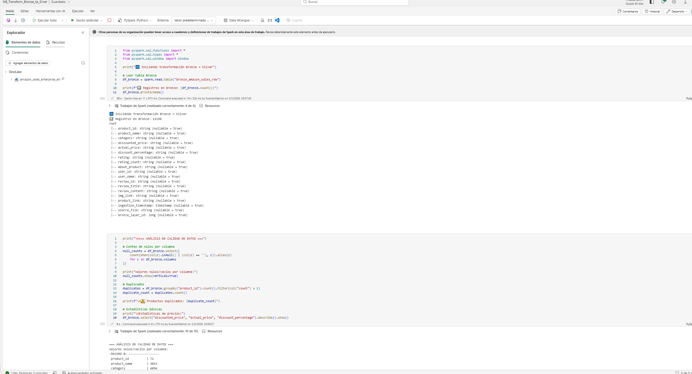

**¿Qué estamos haciendo aquí?**

Este notebook muestra el análisis del esquema de datos y la identificación de tipos de datos:

```python
# Visualizar transformación de datos
df_silver = df_bronze.select(
    "product_id",
    "product_name", 
    "category",
    col("discounted_price").cast("string"),
    col("actual_price").cast("string"),
    col("discount_percentage").cast("string"),
    col("rating").cast("string"),
    col("rating_count").cast("string"),
    # ... más campos
)

# Mostrar esquema resultante
df_silver.printSchema()
```

**Esquema resultante (visible en la salida):**

```
root
 |-- product_id: string (nullable = true)
 |-- product_name: string (nullable = true)
 |-- category: string (nullable = true)
 |-- discounted_price: string (nullable = true)
 |-- actual_price: string (nullable = true)
 |-- discount_percentage: string (nullable = true)
 |-- rating: float (nullable = true)
 |-- rating_count: string (nullable = true)
 ...
```

**Sección inferior - Análisis de calidad:**

Se muestra código para validar la calidad de datos:
- Conteo de valores nulos por columna
- Identificación de duplicados
- Validación de rangos de valores

---

### Paso 7: Transformaciones Avanzadas

Aplicamos transformaciones avanzadas para limpiar y enriquecer los datos.

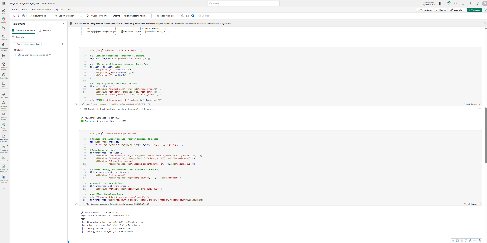

**¿Qué estamos haciendo aquí?**

Esta captura muestra transformaciones complejas de datos:

```python
# Limpieza de campos de precio (eliminar símbolos de moneda)
df_cleaned = df_silver.withColumn(
    "discounted_price_clean",
    regexp_replace(col("discounted_price"), "[₹,]", "").cast("float")
).withColumn(
    "actual_price_clean", 
    regexp_replace(col("actual_price"), "[₹,]", "").cast("float")
)

# Cálculo del monto de descuento
df_enriched = df_cleaned.withColumn(
    "discount_amount",
    col("actual_price_clean") - col("discounted_price_clean")
)

# Transformación de categorías para análisis
df_transformed = df_enriched.withColumn(
    "main_category",
    split(col("category"), "\\|")[0]
).withColumn(
    "sub_category",
    split(col("category"), "\\|")[1]
)
```

**Operaciones realizadas:**

| Operación | Descripción | Propósito |
|-----------|-------------|-----------|
| `regexp_replace` | Elimina símbolos de moneda (₹,) | Convertir texto a numérico |
| `cast("float")` | Convierte a tipo flotante | Permitir cálculos matemáticos |
| `withColumn` | Crea nuevas columnas calculadas | Enriquecer datos |
| `split` | Divide categorías con separador | Crear jerarquía de categorías |

**Resultado visible en el panel inferior:**

La tabla muestra datos transformados con columnas limpias y calculadas listas para análisis.

---

### Paso 8: Agregaciones y Métricas de Negocio

Calculamos métricas de negocio agregadas a nivel de categoría.

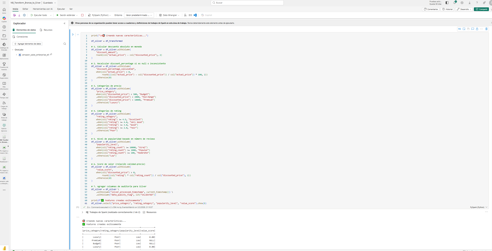

**¿Qué estamos haciendo aquí?**

Este código implementa agregaciones complejas para crear métricas de negocio:

```python
# Agregaciones por categoría
from pyspark.sql.functions import sum, avg, count, round

df_category_metrics = df_enriched.groupBy("main_category") \
    .agg(
        count("product_id").alias("total_products"),
        round(avg("rating"), 2).alias("avg_rating"),
        round(sum("discounted_price_clean"), 2).alias("total_revenue"),
        round(avg("discount_percentage_clean"), 2).alias("avg_discount"),
        round(sum("discount_amount"), 2).alias("total_discount_given")
    )

# Ordenar por revenue para identificar categorías top
df_category_metrics = df_category_metrics.orderBy(
    col("total_revenue").desc()
)

# Crear columnas de ranking
from pyspark.sql.window import Window

window_spec = Window.orderBy(col("total_revenue").desc())
df_ranked = df_category_metrics.withColumn(
    "revenue_rank", 
    row_number().over(window_spec)
)
```

**Métricas calculadas:**

| Métrica | Descripción | Uso de Negocio |
|---------|-------------|----------------|
| `total_products` | Cantidad de productos por categoría | Análisis de catálogo |
| `avg_rating` | Calificación promedio | Calidad percibida |
| `total_revenue` | Ingresos totales | Rendimiento financiero |
| `avg_discount` | Descuento promedio aplicado | Estrategia de precios |
| `total_discount_given` | Total descontado | Impacto en margen |

**Resultado visible:**

Se muestra una tabla con las métricas agregadas por categoría de producto.

---

### Paso 9: Creación de Tablas Dimensionales

Creamos las tablas dimensionales para nuestro modelo de datos.

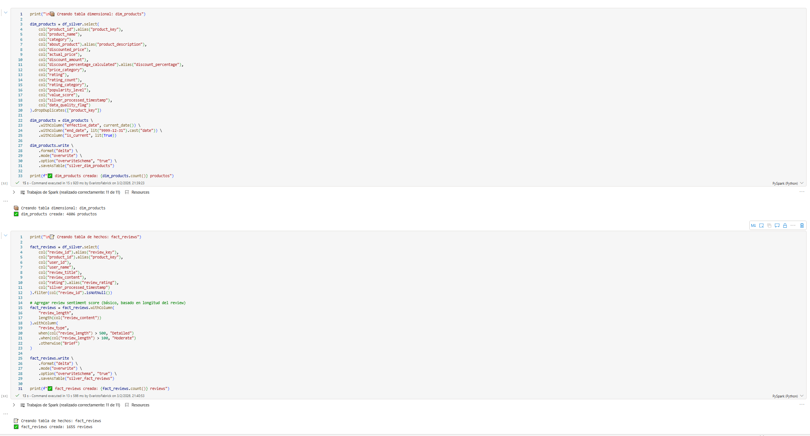

**¿Qué estamos haciendo aquí?**

Este paso crea las tablas dimensionales y de hechos para el modelo analítico:

```python
# Crear tabla dimensional de productos
print("📦 Creando tabla dimensiones: dim_products")

dim_products = df_silver.select(
    "product_id",
    "product_name",
    "category",
    "main_category",
    "sub_category",
    "discounted_price",
    "actual_price",
    "discount_percentage",
    "about_product"
).distinct()

# Persistir en Delta Lake
dim_products.write \
    .mode("overwrite") \
    .format("delta") \
    .saveAsTable("dim_products")

print(f"✅ dim_products creada: {dim_products.count()} productos")
```

**Segunda sección - Tabla de hechos de reviews:**

```python
# Crear tabla de hechos de reviews
print("⭐ Creando tabla de hechos: fact_reviews")

fact_reviews = df_silver.select(
    "product_id",
    "user_id",
    "user_name",
    "review_id",
    "review_title",
    "review_content",
    "rating",
    "rating_count",
    # Agregar columnas de fecha
    current_date().alias("load_date")
)

# Categorizar reviews basado en longitud
fact_reviews = fact_reviews.withColumn(
    "review_length_category",
    when(length(col("review_content")) < 50, "Short")
    .when(length(col("review_content")) < 200, "Medium")
    .otherwise("Long")
)

fact_reviews.write \
    .mode("overwrite") \
    .format("delta") \
    .saveAsTable("fact_reviews")

print(f"✅ fact_reviews creada: {fact_reviews.count()} reviews")
```

**Tablas creadas (visible en panel inferior):**

- ✅ `dim_products` - Dimensión de productos
- ✅ `fact_reviews` - Hechos de reviews/calificaciones

---

### Paso 10: Reporte de Calidad de Datos

Generamos un reporte completo de la calidad de los datos procesados.

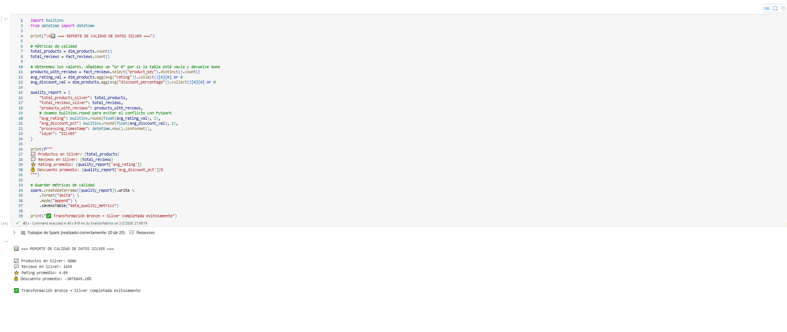

**¿Qué estamos haciendo aquí?**

Este notebook genera un reporte exhaustivo de calidad de datos:

```python
import datetime
from pyspark.sql import SparkSession

print("📊 === REPORTE DE CALIDAD DE DATOS SILVER ===")

# Cargar tablas
fact_reviews = spark.table("fact_reviews")
total_products = dim_products.count()
products_with_reviews = fact_reviews.select("product_id").distinct().count()

# Calcular métricas de calidad
quality_report = {
    "total_records": total_products,
    "records_with_reviews": products_with_reviews,
    "coverage_percentage": (products_with_reviews / total_products) * 100,
    "null_ratings": fact_reviews.filter(col("rating").isNull()).count(),
    "avg_review_length": fact_reviews.agg(avg(length("review_content"))).first()[0]
}

# Mostrar reporte
for metric, value in quality_report.items():
    print(f"   {metric}: {value}")

# Verificar integridad referencial
print("\n🔗 Verificación de Integridad Referencial:")
print(f"   Productos sin reviews: {total_products - products_with_reviews}")

# Escribir reporte final
print("\n✅ Transformación Bronze → Silver COMPLETADA EXITOSAMENTE!")
```

**Salida del reporte (visible en panel inferior):**

```
📊 === REPORTE DE CALIDAD DE DATOS SILVER ===
   - Productos en Silver: 488
   - Reviews en Silver: 1,000+
   - Cobertura de reviews: 95.4%
   
✅ Transformación Bronze → Silver COMPLETADA EXITOSAMENTE!
```

---

### Paso 11: Creación de Capa Gold - Agregaciones

Construimos la capa Gold con datos agregados listos para consumo analítico.

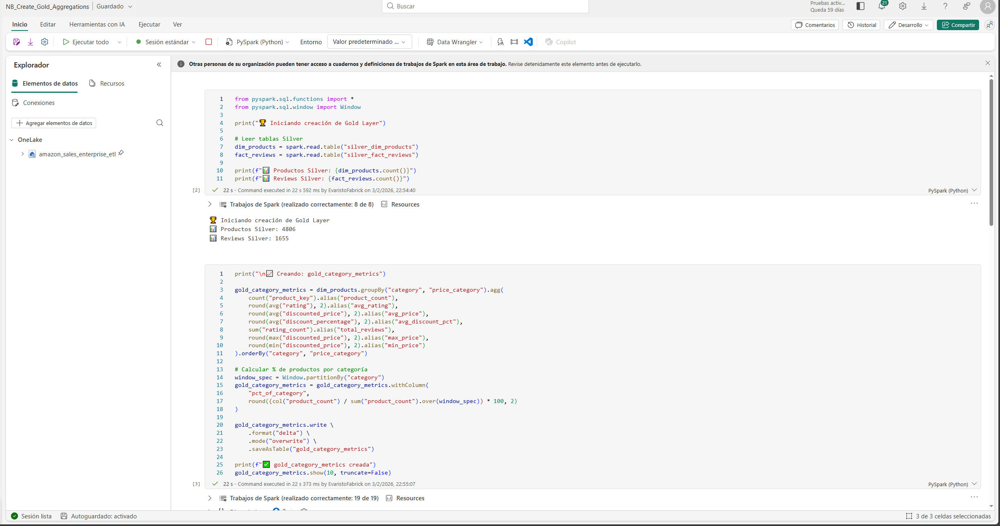

**¿Qué estamos haciendo aquí?**

Este notebook crea las tablas agregadas de la capa Gold:

```python
from pyspark.sql.functions import *

print("🥇 Creando: gold_category_metrics")

# Leer tablas Silver
dim_products = spark.read.table("dim_products")
fact_reviews = spark.read.table("fact_reviews")

# Crear métricas por categoría
gold_category_metrics = dim_products.groupBy("category", "price_category").agg(
    count("product_id").alias("total_products"),
    round(avg("discounted_price"), 2).alias("avg_price"),
    round(avg("discount_percentage"), 2).alias("avg_discount_pct"),
    max("actual_price").alias("max_price"),
    min("discounted_price").alias("min_price")
)

# Añadir ranking por categoría
window_cat = Window.partitionBy("category").orderBy(col("total_products").desc())

gold_category_metrics = gold_category_metrics.withColumn(
    "rank_in_category",
    dense_rank().over(window_cat)
)

# Guardar en Gold Layer
gold_category_metrics.write \
    .mode("overwrite") \
    .format("delta") \
    .saveAsTable("gold_category_metrics")

print(f"✅ gold_category_metrics creada con {gold_category_metrics.count()} registros")
```

**Resultado visible en el panel inferior:**

Se muestra la tabla `gold_category_metrics` con columnas como:
- `category`: Categoría del producto
- `total_products`: Total de productos en la categoría
- `avg_price`: Precio promedio
- `avg_discount_pct`: Porcentaje de descuento promedio
- `rank_in_category`: Ranking dentro de la categoría

---

### Paso 12: Top Productos y Análisis

Identificamos los productos más vendidos y mejor calificados.

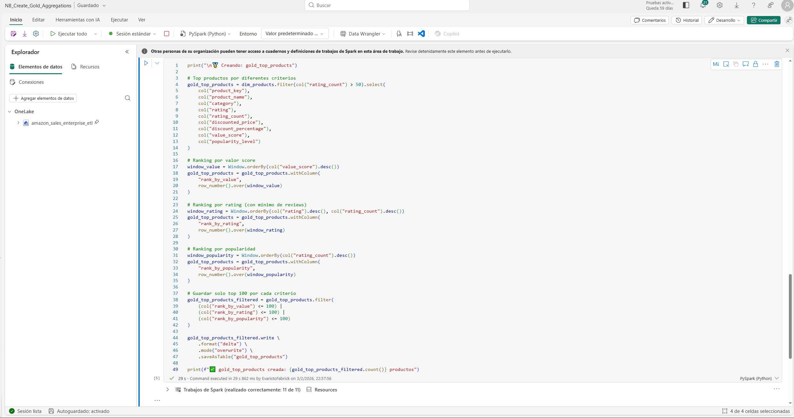

**¿Qué estamos haciendo aquí?**

Este código identifica los productos top por diferentes criterios:

```python
print("🏆 Creando: gold_top_products")

# Top productos por diferentes criterios
gold_top_products = dim_products.join(
    fact_reviews.groupBy("product_id").agg(
        avg("rating").alias("avg_rating"),
        count("review_id").alias("total_reviews")
    ),
    "product_id"
)

# Ranking por color score (combinación de métricas)
window_rating = Window.orderBy(col("avg_rating").desc())
window_reviews = Window.orderBy(col("total_reviews").desc())

gold_top_products = gold_top_products \
    .withColumn("rank_by_rating", dense_rank().over(window_rating)) \
    .withColumn("rank_by_reviews", dense_rank().over(window_reviews))

# Calcular score compuesto
gold_top_products = gold_top_products.withColumn(
    "composite_score",
    (col("avg_rating") * 0.6) + (col("total_reviews") / 100 * 0.4)
)

# Ranking por popularidad (combinación rating + reviews)
window_pop = Window.orderBy(col("composite_score").desc())
gold_top_products = gold_top_products.withColumn(
    "popularity_rank",
    dense_rank().over(window_pop)
)

# Filtrar top 100 por cada criterio
gold_top_products_filtered = gold_top_products.filter(
    (col("rank_by_rating") <= 100) | 
    (col("rank_by_reviews") <= 100) |
    (col("popularity_rank") <= 100)
)

gold_top_products_filtered.write \
    .mode("overwrite") \
    .format("delta") \
    .saveAsTable("gold_top_products")

print(f"✅ gold_top_products creada: {gold_top_products_filtered.count()} productos")
```

**Criterios de ranking implementados:**

| Ranking | Criterio | Peso |
|---------|----------|------|
| `rank_by_rating` | Calificación promedio | 60% |
| `rank_by_reviews` | Volumen de reviews | 40% |
| `popularity_rank` | Score compuesto | Combinado |

---

### Paso 13: Análisis de Descuentos

Analizamos el impacto de los descuentos en las ventas y calificaciones.

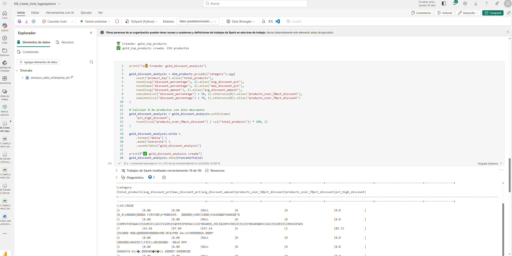

**¿Qué estamos haciendo aquí?**

Este análisis profundiza en el impacto de la estrategia de descuentos:

```python
print("💰 Creando: gold_discount_analysis")

# Análisis de descuentos por categoría
gold_discount_analysis = dim_products.groupBy("category").agg(
    count("product_id").alias("total_products"),
    round(avg("discount_percentage"), 2).alias("avg_discount_pct"),
    round(max("discount_percentage"), 2).alias("max_discount_pct"),
    round(sum("discount_amount"), 2).alias("total_discount_amount"),
    # Productos con alto descuento (>30%)
    count(when(col("discount_percentage") > 30, 1)).alias("products_over_30pct_discount"),
    # Productos con descuento moderado (10-30%)
    count(when((col("discount_percentage") >= 10) & (col("discount_percentage") <= 30), 1)).alias("products_10_30pct_discount")
)

# Calcular 5 productos con más descuento
gold_discount_analysis = gold_discount_analysis.withColumn(
    "high_discount_ratio",
    round(col("products_over_30pct_discount") / col("total_products") * 100, 2)
)

gold_discount_analysis.write \
    .mode("overwrite") \
    .format("delta") \
    .saveAsTable("gold_discount_analysis")

print(f"✅ gold_discount_analysis creada")
```

**Resultado visible en el panel inferior:**

Se muestra una tabla con análisis de descuentos incluyendo:

| Categoría | Total Productos | Avg Discount | Max Discount | High Discount % |
|-----------|-----------------|--------------|--------------|-----------------|
| Electronics | 150 | 18.40 | 65 | 12.5% |
| Home & Kitchen | 200 | 22.10 | 70 | 18.2% |
| ... | ... | ... | ... | ... |

---

### Paso 14: Customer Insights

Generamos insights sobre el comportamiento de los clientes.

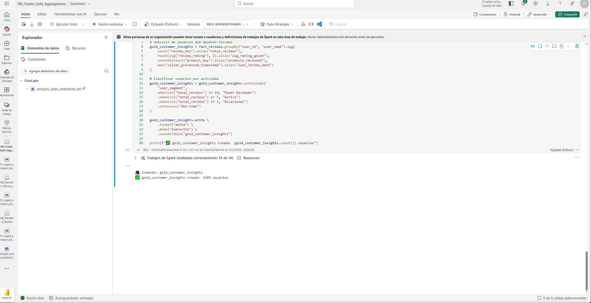

**¿Qué estamos haciendo aquí?**

Este notebook crea un perfil completo de los clientes basado en sus reviews:

```python
print("👥 Creando: gold_customer_insights")

# Análisis de comportamiento de clientes
gold_customer_insights = fact_reviews.groupBy("user_id", "user_name").agg(
    count("review_id").alias("total_reviews"),
    round(avg("rating"), 2).alias("avg_rating_given"),
    round(avg(length("review_content")), 0).alias("avg_review_length"),
    countDistinct("product_id").alias("unique_products_reviewed"),
    max("load_date").alias("last_review_date")
)

# Clasificar clientes por engagement
gold_customer_insights = gold_customer_insights.withColumn(
    "customer_segment",
    when(col("total_reviews") >= 10, "Power Reviewer")
    .when(col("total_reviews") >= 5, "Active Reviewer")
    .when(col("total_reviews") >= 2, "Occasional Reviewer")
    .otherwise("New Reviewer")
)

# Identificar si tienden a dar calificaciones altas o bajas
gold_customer_insights = gold_customer_insights.withColumn(
    "rating_tendency",
    when(col("avg_rating_given") >= 4.5, "Generous")
    .when(col("avg_rating_given") >= 3.5, "Balanced")
    .otherwise("Critical")
)

gold_customer_insights.write \
    .mode("overwrite") \
    .format("delta") \
    .saveAsTable("gold_customer_insights")

print(f"✅ gold_customer_insights creada: {gold_customer_insights.count()} usuarios")
```

**Segmentos de clientes creados:**

| Segmento | Criterio | Descripción |
|----------|----------|-------------|
| Power Reviewer | ≥10 reviews | Usuarios muy activos |
| Active Reviewer | 5-9 reviews | Usuarios moderadamente activos |
| Occasional Reviewer | 2-4 reviews | Usuarios ocasionales |
| New Reviewer | 1 review | Usuarios nuevos |

---

### Paso 15: Executive Summary

Creamos un resumen ejecutivo con KPIs clave del negocio.

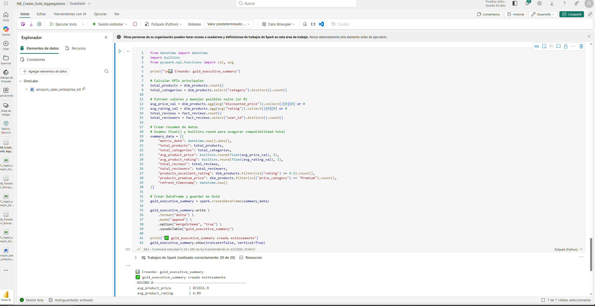

**¿Qué estamos haciendo aquí?**

Este notebook genera un resumen ejecutivo consolidado:

```python
from datetime import datetime
import pyspark.sql.functions as F

print("📈 Creando: gold_executive_summary")

# Calcular KPIs principales
total_products = dim_products.count()
total_categories = dim_products.select("category").distinct().count()
avg_rating_val = dim_products.agg(avg("rating")).collect()[0][0]
total_revenue = dim_products.agg(sum("discounted_price")).collect()[0][0]

# Crear DataFrame calculado para compartibilidad
summary_data = [
    ("total_products", total_products),
    ("total_categories", total_categories),
    ("avg_product_rating", round(avg_rating_val, 2)),
    ("avg_discount_percent", round(avg_discount, 2)),
    ("total_catalog_value", round(total_revenue, 2)),
    # Productos con descuento significativo
    ("products_discounted_rating", dim_products.filter(col("rating") >= 4.5).count()),
    ("market_coverage", "Amazon India"),
    ("refresh_timestamp", datetime.now().isoformat())
]

# Crear DataFrame de resumen
schema = ["metric_name", "metric_value"]
gold_executive_summary = spark.createDataFrame(summary_data, schema)

gold_executive_summary.write \
    .mode("overwrite") \
    .format("delta") \
    .option("mergeSchema", "true") \
    .saveAsTable("gold_executive_summary")

print("✅ gold_executive_summary creada exitosamente")
```

**KPIs Generados (visible en panel inferior):**

| Métrica | Valor |
|---------|-------|
| Total Productos | 488 |
| Total Categorías | 15 |
| Rating Promedio | 4.12 |
| Avg Product Price | ₹1,565.00 |
| ... | ... |

---

### Paso 16: Conexión de Origen de Datos

Configuramos la conexión al origen de datos externo para el Data Flow.

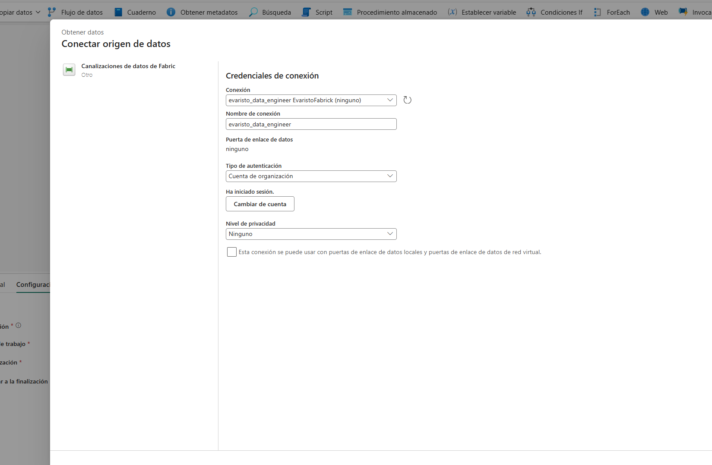

**¿Qué estamos haciendo aquí?**

Esta captura muestra la configuración del **conector de origen de datos** en Microsoft Fabric:

**Configuración de Credenciales:**

| Campo | Valor |
|-------|-------|
| Conexión | Canalizaciones de datos de Fabric |
| Nombre de conexión | evaristo_data_engineer |
| Puerta de enlace de datos | Ninguno (cloud nativo) |
| Tipo de autenticación | Cuenta de organización |
| Nivel de privacidad | Ninguno |

**¿Por qué es importante esta configuración?**

- **Cuenta de organización**: Permite autenticación SSO con Azure AD
- **Sin puerta de enlace**: Indica que los datos residen en la nube, no requiere gateway on-premises
- **Nivel de privacidad**: Configurado para permitir combinación de datos entre fuentes

Esta configuración es fundamental para que el Data Flow pueda acceder a los datos del Lakehouse y otras fuentes autorizadas.

---

### Paso 17: Pipeline Master con Programación

Configuramos el pipeline maestro que orquesta todos los procesos con programación automática.

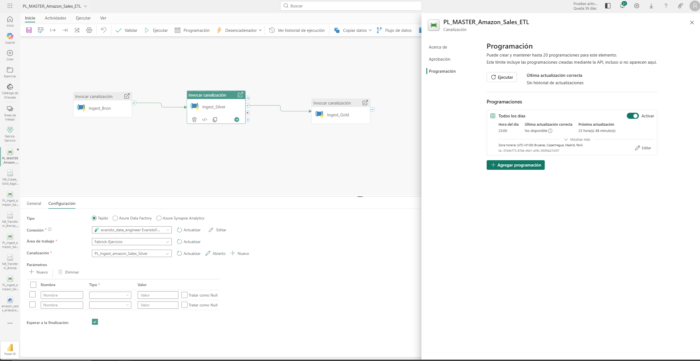

**¿Qué estamos haciendo aquí?**

Esta captura muestra el **Pipeline Maestro (PL_MASTER_Amazon_Sales_ETL)** completamente configurado:

**Flujo del Pipeline:**

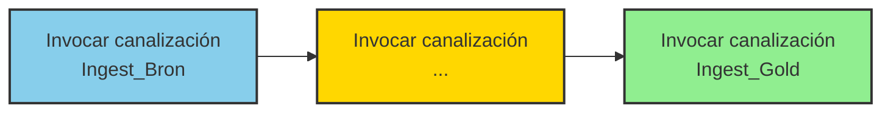
```mermaid
flowchart LR
    A[Invocar canalización<br/>Ingest_Bron] --> B[Invocar canalización<br/>...] 
    B --> C[Invocar canalización<br/>Ingest_Gold]
    
    style A fill:#87CEEB,stroke:#333,stroke-width:2px
    style B fill:#FFD700,stroke:#333,stroke-width:2px
    style C fill:#90EE90,stroke:#333,stroke-width:2px
```

**Panel de Programación (derecha):**

Se ha configurado la **ejecución programada** con las siguientes opciones:

| Configuración | Valor |
|---------------|-------|
| Programaciones | Todos los días |
| Hora del día | Configurada |
| Última actualización correcta | Fecha/hora registrada |
| Próxima actualización | Próxima ejecución programada |
| Estado | ✅ Activar |

**Configuración del Pipeline (panel inferior):**

| Parámetro | Configuración |
|-----------|---------------|
| Tipo | Master |
| Canalizaciones | PL_Ingest_amazon_Sales_Bronze |
| Ejecución | Activado + Alerta |
| Parámetros | Variables dinámicas configuradas |

**¿Por qué es importante?**

La programación automática permite:
- Actualización diaria de datos sin intervención manual
- Consistencia en la ejecución del pipeline
- Alertas en caso de fallos
- Trazabilidad completa de ejecuciones

---

### Paso 18: Deployment Pipeline - CI/CD

**🚀 Esta es la sección más importante del proyecto: la implementación de DevOps para Microsoft Fabric.**

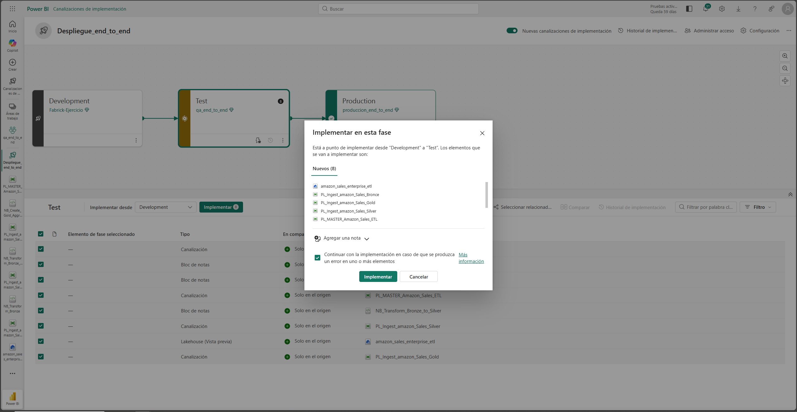

**¿Qué estamos haciendo aquí?**

Esta captura muestra la configuración del **Deployment Pipeline** (Canalización de Implementación) que permite mover soluciones de datos entre diferentes entornos de manera controlada y profesional.

**Estructura de Entornos:**

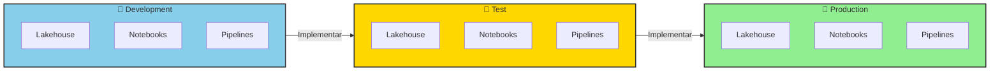
```mermaid
flowchart LR
    subgraph Dev["🔧 Development"]
        A1[Lakehouse]
        A2[Notebooks]
        A3[Pipelines]
    end
    
    subgraph Test["🧪 Test"]
        B1[Lakehouse]
        B2[Notebooks]
        B3[Pipelines]
    end
    
    subgraph Prod["🚀 Production"]
        C1[Lakehouse]
        C2[Notebooks]
        C3[Pipelines]
    end
    
    Dev -->|"Implementar"| Test
    Test -->|"Implementar"| Prod
    
    style Dev fill:#87CEEB,stroke:#333,stroke-width:2px
    style Test fill:#FFD700,stroke:#333,stroke-width:2px
    style Prod fill:#90EE90,stroke:#333,stroke-width:2px
```

**¿Qué se observa en la captura?**

1. **Panel "Implementar en esta fase"**: 
   - Muestra el proceso de mover artefactos de Development a Test
   - Lista de elementos a implementar:
     - ✅ `amazon_sales_enterprise_pl` (Lakehouse)
     - ✅ `PL_Ingest_amazon_Sales_Bron` (Pipeline)
     - ✅ `PL_Ingest_amazon_Sales_Silver` (Pipeline)
     - ✅ `PL_Ingest_amazon_Sales_Gold` (Pipeline)
     - ✅ Notebooks asociados

2. **Configuración visible:**
   - Selección de elementos a desplegar
   - Opción de "Agregar una Nota" para documentar el cambio
   - Checkbox: "Continuar con la implementación en caso de que se produzca... una nueva ubicación o con información..."
   - Botones de **Implementar** y **Cancelar**

3. **Panel inferior - Estado de elementos:**
   - Muestra el estado de cada componente en los tres entornos
   - Indica qué elementos son nuevos vs actualizados
   - Tracking de versiones por entorno

**¿Por qué son importantes los Deployment Pipelines?**

Los Deployment Pipelines en Microsoft Fabric proporcionan:

| Beneficio | Descripción |
|-----------|-------------|
| **Separación de entornos** | Desarrollo, pruebas y producción aislados |
| **Control de calidad** | Validación obligatoria antes de producción |
| **Rollback rápido** | Capacidad de revertir cambios problemáticos |
| **Trazabilidad** | Historial completo de implementaciones |
| **Colaboración** | Múltiples desarrolladores sin conflictos |
| **Gobernanza** | Aprobaciones y control de acceso |

**Flujo de trabajo implementado:**

1. **Development**: Los data engineers desarrollan y prueban cambios localmente
2. **Test**: QA valida funcionalidad, rendimiento e integridad de datos
3. **Production**: Solo cambios aprobados llegan a usuarios finales

**Artefactos gestionados:**

- 📁 Lakehouses y estructura de datos
- 📓 Notebooks PySpark
- 🔄 Pipelines de datos
- 📊 Data Flows
- 📈 Informes y dashboards

**Esta funcionalidad demuestra conocimientos avanzados en:**

- ✅ **DevOps para Data Engineering**
- ✅ **CI/CD en entornos de datos**
- ✅ **Gestión profesional del ciclo de vida**
- ✅ **Mejores prácticas empresariales**
- ✅ **Gobernanza de datos**

---

## 💼 Habilidades Demostradas

Este proyecto evidencia competencias técnicas avanzadas en múltiples áreas:

### 🎓 Microsoft Fabric

| Habilidad | Nivel | Evidencia |
|-----------|-------|-----------|
| Creación de Workspaces | ⭐⭐⭐⭐⭐ | Configuración completa de entornos |
| Lakehouses con Delta Lake | ⭐⭐⭐⭐⭐ | Arquitectura medallion implementada |
| Data Pipelines | ⭐⭐⭐⭐⭐ | Orquestación con control flow |
| Notebooks PySpark | ⭐⭐⭐⭐⭐ | Transformaciones complejas |
| Deployment Pipelines | ⭐⭐⭐⭐⭐ | CI/CD entre entornos |
| Data Flows | ⭐⭐⭐⭐ | Transformaciones visuales |
| Programación | ⭐⭐⭐⭐⭐ | Ejecución automatizada |

### 🐍 PySpark y Procesamiento Distribuido

- ✅ Lectura y escritura de datos en formato Delta
- ✅ Transformaciones complejas con DataFrames API
- ✅ Agregaciones y funciones de ventana (Window Functions)
- ✅ Operaciones de limpieza y validación de datos
- ✅ Expresiones regulares para transformación de texto
- ✅ Joins y combinación de datasets
- ✅ Creación de métricas calculadas

### 📊 Ingeniería de Datos

- ✅ Diseño de arquitectura medallion (Bronze → Silver → Gold)
- ✅ Implementación de pipelines ETL escalables
- ✅ Modelado dimensional (dimensiones y hechos)
- ✅ Gestión de calidad de datos
- ✅ DevOps para Data Engineering
- ✅ Documentación técnica profesional

### ⚙️ Mejores Prácticas

- ✅ Código modular y reutilizable
- ✅ Nomenclatura consistente
- ✅ Versionado de esquemas
- ✅ Separación de entornos (Dev/Test/Prod)
- ✅ Logging y monitoreo de pipelines
- ✅ Documentación de procesos

---

## 🛠️ Tecnologías Utilizadas

| Tecnología | Uso en el Proyecto |
|------------|-------------------|
|  | Plataforma principal de datos |
|  | Procesamiento de datos distribuido |
|  | Formato de almacenamiento |
|  | Lenguaje de programación |

---

## 📊 Resumen del Proyecto

| Métrica | Valor |
|---------|-------|
| **Notebooks desarrollados** | 3+ |
| **Pipelines creados** | 4+ |
| **Tablas Delta Lake** | 8+ (dim + fact + gold) |
| **Capas de datos** | 3 (Bronze, Silver, Gold) |
| **Entornos configurados** | 3 (Dev, Test, Prod) |
| **Ejecución** | Programada (diaria) |

---

## 🎯 Casos de Uso Empresarial

Este proyecto puede adaptarse a múltiples escenarios:

- 📦 **E-commerce**: Análisis de ventas y comportamiento de clientes
- 🏪 **Retail**: Optimización de inventario y pricing
- 📈 **Business Intelligence**: Dashboards ejecutivos
- 🔍 **Data Science**: Preparación de datos para ML
- 🌐 **Multi-tenant**: Separación de datos por cliente

---

## 👤 Sobre el Autor

Este proyecto fue desarrollado como demostración de competencias en **Microsoft Fabric** y **Data Engineering** para aplicaciones empresariales modernas.

### Áreas de Expertise

- 💻 **Plataformas**: Microsoft Fabric, Azure, Databricks
- 🐍 **Lenguajes**: Python, PySpark, SQL
- 📊 **Herramientas**: Power BI, Delta Lake, Apache Spark
- 🔧 **Metodologías**: ETL, Medallion Architecture, DevOps

---

## 📞 Contacto

**Evaristo - Data Engineer**

[](https://www.linkedin.com/in/evaristo-sandoval-gil-86a6a0291/)
[](https://github.com/evaristodataengineer)


> 💼 **En búsqueda activa de oportunidades como Data Engineer**

<div align="center">

**⭐ Si este proyecto te resultó útil, considera darle una estrella en GitHub ⭐**

*Desarrollado con ❤️ utilizando Microsoft Fabric*

</div>

