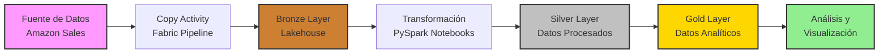
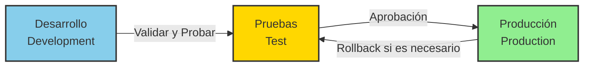

# 📊 Pipeline ETL de Datos de Ventas en Microsoft Fabric

> **Proyecto completo de ingeniería de datos** que demuestra el dominio de Microsoft Fabric para la construcción de pipelines ETL empresariales, procesamiento de datos con PySpark y creación de flujos de datos automatizados.

[](https://fabric.microsoft.com/)
[](https://spark.apache.org/)
[](https://www.python.org/)

---

## 🎯 Descripción del Proyecto

Este proyecto implementa una **solución ETL completa en Microsoft Fabric** para el procesamiento y análisis de datos de ventas. El pipeline extrae datos desde fuentes externas (Amazon Sales), los transforma aplicando lógica de negocio compleja utilizando PySpark, y los carga en un lakehouse optimizado para análisis empresarial.

### 🌟 Características Principales

- **Pipeline ETL Automatizado**: Orquestación completa del flujo de datos desde la extracción hasta la carga
- **Procesamiento Distribuido**: Transformaciones de datos usando PySpark en notebooks de Fabric
- **Lakehouse Medallion Architecture**: Implementación de capas Bronze, Silver y Gold para organización de datos
- **Data Flow Integration**: Integración de flujos de datos con múltiples conectores y transformaciones
- **Deployment Pipelines**: Canalizaciones de implementación para facilitar el movimiento de soluciones entre entornos

---

## 🏗️ Arquitectura del Proyecto



---

## 🔧 Componentes Técnicos

### 1️⃣ **Data Pipeline - Orquestación ETL**

El pipeline principal coordina todo el proceso de ingesta y transformación de datos:

- **Copy Data Activity**: Extracción de datos desde fuentes externas con configuración de:
  - Optimización inteligente de rendimiento (automático)
  - Paralelismo de copia automático
  - Tolerancia a errores configurable
  - Habilitación de registro de actividades

- **Notebook Activities**: Ejecución secuencial de transformaciones PySpark
- **Control Flow**: Lógica de control para gestión de errores y excepciones

### 2️⃣ **Notebooks PySpark - Transformación de Datos**

#### 📓 **Notebook 1: Load Data (Carga Inicial)**
```python
# Carga de datos brutos desde archivos CSV
df = spark.read.format("csv") \
    .option("header", "true") \
    .option("inferSchema", "true") \
    .load("Files/ventas_amazon/")

# Exploración inicial de datos
df.printSchema()
df.show()
```

**Operaciones realizadas:**
- Lectura de archivos CSV con inferencia de esquema
- Validación de calidad de datos
- Carga inicial en formato Delta para optimización

#### 📓 **Notebook 2: Sales Aggregation (Agregaciones de Ventas)**
```python
# Agregaciones por categoría de producto
df_product_revenue = df.groupBy("Category", "Year_month") \
    .agg(
        sum("product_selling_price").alias("total_revenue"),
        count("product_id").alias("total_products"),
        avg("rating").alias("avg_rating")
    )

# Cálculos de métricas de negocio
df_profit_metrics = df.withColumn(
    "profit_margin",
    (col("actual_price") - col("discounted_price")) / col("actual_price")
)
```

**Capacidades demostradas:**
- Agregaciones complejas con múltiples funciones
- Creación de métricas de negocio calculadas
- Transformaciones de columnas con Window Functions
- Optimización de queries con broadcast joins

#### 📓 **Notebook 3: Customer Segmentation (Segmentación de Clientes)**
```python
# Segmentación de clientes por comportamiento de compra
from pyspark.sql.window import Window

window_spec = Window.partitionBy("user_id").orderBy("rating_count")

df_customer_segments = df.withColumn(
    "customer_category",
    when(col("rating_count") > 1000, "High_Engagement")
    .when(col("rating_count") > 500, "Medium_Engagement")
    .otherwise("Low_Engagement")
)
```

**Análisis implementados:**
- Segmentación de clientes basada en métricas de engagement
- Análisis de valor de cliente (CLV)
- Identificación de productos best-sellers
- Análisis temporal de tendencias de ventas

### 3️⃣ **Lakehouse - Almacenamiento Delta Lake**

Implementación de arquitectura medallion:

- **🥉 Bronze Layer**: Datos brutos sin procesar (copia exacta de origen)
- **🥈 Silver Layer**: Datos limpios y validados con esquema definido
- **🥇 Gold Layer**: Datos agregados listos para consumo analítico

**Ventajas del enfoque:**
- Trazabilidad completa de transformaciones
- Recuperación ante fallos (time travel)
- Optimización de consultas con formato Delta
- Particionamiento inteligente de datos

### 4️⃣ **Data Flow - Flujo de Datos Visual**

Creación de flujos de datos sin código con:
- Conectores a múltiples orígenes de datos
- Transformaciones visuales (filtros, agregaciones, joins)
- Mapeo de columnas y transformaciones de tipos de datos
- Carga incremental optimizada

### 5️⃣ **Deployment Pipelines - Canalizaciones de Implementación** 🚀

> **Característica destacada del proyecto**: Implementación de DevOps para Microsoft Fabric

La **canalización de implementación** (Deployment Pipeline) configurada en este proyecto permite:

#### ✨ ¿Qué son las Deployment Pipelines?

Las Deployment Pipelines en Microsoft Fabric son una característica de **CI/CD (Continuous Integration/Continuous Deployment)** que facilita el ciclo de vida del desarrollo de soluciones de datos empresariales.

#### 🎯 Beneficios Implementados

1. **Separación de Entornos**:
   - **Development (Desarrollo)**: Espacio de trabajo para pruebas y desarrollo
   - **Test (Pruebas)**: Validación de cambios antes de producción
   - **Production (Producción)**: Entorno en vivo para usuarios finales

2. **Migración Simplificada de Artefactos**:
   - Movimiento de pipelines, notebooks, lakehouse y datasets entre entornos
   - Un solo clic para desplegar cambios validados
   - Rollback rápido en caso de problemas

3. **Control de Versiones y Gobernanza**:
   - Historial de implementaciones
   - Aprobaciones antes de mover a producción
   - Trazabilidad de cambios en objetos de Fabric

4. **Configuración de Parámetros por Entorno**:
   - Diferentes cadenas de conexión según el entorno
   - Configuración de variables específicas
   - Seguridad y aislamiento de datos

#### 🔄 Flujo de Trabajo Implementado



**Proceso de implementación:**
1. Desarrollo de pipelines y notebooks en el workspace de Development
2. Implementación a Test para validación de QA
3. Ejecución de pruebas de integración y rendimiento
4. Despliegue final a Production tras aprobación
5. Monitoreo continuo y posibilidad de rollback

Esta práctica demuestra **conocimientos avanzados en DevOps para Data Engineering**, una habilidad muy valorada en entornos empresariales modernos.

---

## 💼 Habilidades Demostradas

Este proyecto evidencia competencias técnicas en:

### 🎓 Microsoft Fabric
- ✅ Creación y gestión de **Workspaces**
- ✅ Configuración de **Lakehouses** con Delta Lake
- ✅ Desarrollo de **Data Pipelines** con copy activities y control flow
- ✅ Implementación de **Notebooks PySpark**
- ✅ Configuración de **Deployment Pipelines** para CI/CD
- ✅ Integración de **Data Flows** para transformaciones visuales

### 🐍 PySpark y Procesamiento Distribuido
- ✅ Lectura y escritura de datos en formato Delta
- ✅ Transformaciones complejas con DataFrames API
- ✅ Agregaciones y funciones de ventana (Window Functions)
- ✅ Optimización de queries con broadcast y particionamiento
- ✅ Operaciones de limpieza y validación de datos

### 📊 Ingeniería de Datos
- ✅ Diseño de arquitectura medallion (Bronze, Silver, Gold)
- ✅ Implementación de pipelines ETL escalables
- ✅ Modelado de datos para análisis empresarial
- ✅ Gestión de calidad de datos y validaciones
- ✅ DevOps para Data Engineering con deployment pipelines

### ⚙️ Buenas Prácticas
- ✅ Código modular y reutilizable
- ✅ Documentación de transformaciones
- ✅ Versionado de esquemas
- ✅ Separación de entornos (Dev/Test/Prod)
- ✅ Logging y monitoreo de pipelines

---

## 📸 Capturas del Proyecto

El proyecto incluye evidencia visual del proceso completo:

- **Configuración de Copy Activity** con optimización automática de rendimiento
- **Pipeline completo** con múltiples aktividades encadenadas
- **Notebooks PySpark** con transformaciones de datos complejas
- **Lakehouse structure** organizado por capas
- **Data Flow** con transformaciones visuales
- **Deployment Pipeline** configurado para migración entre entornos
- **Resultados de ejecución** exitosa de todas las actividades

---

## 🚀 Flujo de Ejecución

1. **Extracción**: El pipeline ejecuta la Copy Activity para traer datos desde la fuente Amazon Sales
2. **Carga Bronze**: Los datos brutos se almacenan en el Lakehouse (capa Bronze)
3. **Transformación Silver**: Notebook 1 carga y valida los datos, generando la capa Silver
4. **Agregaciones**: Notebook 2 realiza cálculos de revenue y métricas de producto
5. **Segmentación**: Notebook 3 genera segmentos de clientes y análisis de comportamiento
6. **Carga Gold**: Los datos transformados se guardan en la capa Gold para consumo analítico
7. **Deployment**: Los artefactos se pueden mover a Test/Production mediante la deployment pipeline

---

## 🎯 Casos de Uso Empresarial

Este proyecto puede adaptarse a múltiples escenarios empresariales:

- 📦 **E-commerce**: Análisis de ventas y comportamiento de clientes
- 🏪 **Retail**: Optimización de inventario basado en tendencias
- 📈 **Business Intelligence**: Dashboards ejecutivos con métricas en tiempo real
- 🔍 **Data Science**: Preparación de datos para modelos de ML
- 🌐 **Multi-tenant SaaS**: Separación de datos por cliente con deployment pipelines

---

## 📋 Requisitos Técnicos

- Microsoft Fabric Workspace (capacidad F2 o superior recomendada)
- Licencia de Microsoft Fabric o Power BI Premium
- Conocimientos de:
  - PySpark y Python
  - SQL para queries sobre Delta Lake
  - Conceptos de ETL y Data Warehousing

---

## 🎓 Aprendizajes y Conclusiones

### Fortalezas del Proyecto
- ✅ Arquitectura escalable y mantenible
- ✅ Separación clara de responsabilidades por capas
- ✅ Reutilización de código mediante notebooks modulares
- ✅ Implementación de CI/CD con deployment pipelines

### Mejoras Futuras
- 🔄 Implementar pruebas unitarias para notebooks PySpark
- 📊 Agregar dashboards de Power BI conectados al Gold layer
- ⚡ Incorporar streaming de datos en tiempo real
- 🔐 Añadir controles de seguridad a nivel de fila (RLS)
- 🤖 Integrar modelos de Machine Learning para predicciones

---

## 👤 Sobre el Autor

Este proyecto fue desarrollado como demostración de competencias en **Microsoft Fabric** y **Data Engineering** para aplicaciones empresariales modernas. Refleja la capacidad de diseñar, implementar y gestionar soluciones de datos end-to-end en entornos cloud.

### Habilidades Clave
- 💻 **Plataformas**: Microsoft Fabric, Azure, Databricks
- 🐍 **Lenguajes**: Python, PySpark, SQL
- 📊 **Herramientas**: Power BI, Delta Lake, Apache Spark
- 🔧 **Metodologías**: Data Engineering, ETL, Medallion Architecture, DevOps

---

## 📞 Contacto

¿Interesado en discutir soluciones de datos o colaborar en proyectos?

- 💼 LinkedIn: [Tu perfil de LinkedIn]
- 📧 Email: [Tu email profesional]
- 🌐 Portfolio: [Tu sitio web]

---

## 📄 Licencia

Este proyecto está disponible como portfolio personal. El código y la arquitectura pueden ser utilizados como referencia para proyectos similares.

---

<div align="center">

**⭐ Si este proyecto te resultó útil, considera darle una estrella en GitHub ⭐**

*Desarrollado con ❤️ utilizando Microsoft Fabric*

</div>
